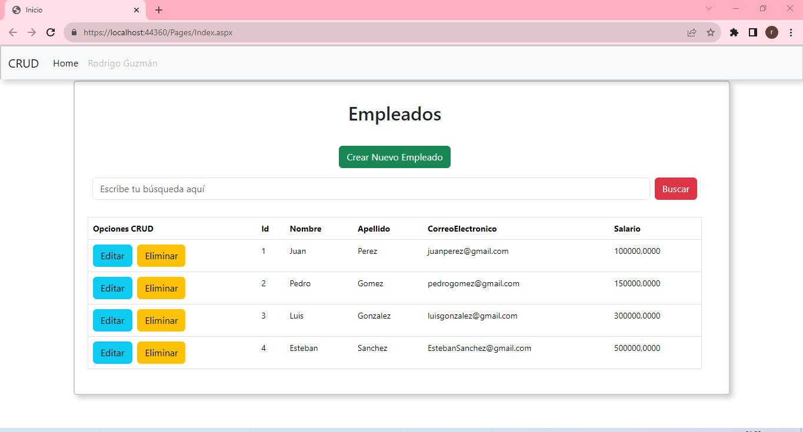
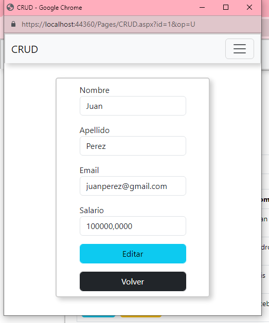

# crud-asp.net.framework-webforms
El crud cuenta con 2 pantallas principales, la pantalla inicial:

y la ventana emergente para Crear, Editar o Eliminar:

En la pantalla principal, por un lado, se puede buscar por Nombre o Apellido, y por otro lado, aparecen los botones correspondientes.
En la ventana emergente, se muestran los datos del empleado que se Creará, Editará o Eliminará. Acá también se incluyeron validaciones de formulario como el formato del mail y textos vacíos.

En el código, se accede a la base de datos de dos maneras:
1-  Para los métodos Crear, Editar y Eliminar, se llama directamente la base de datos desde la clase asociada a la página.
2-  Para los métodos Get, se llama a la base de datos a través de Entity Framework, utilizando alguno de los principios de Clean Architecture.
En estas consultas se utiliza Linq.

Los Scripts de sql se encuentran en la carpeta BaseDeDatos